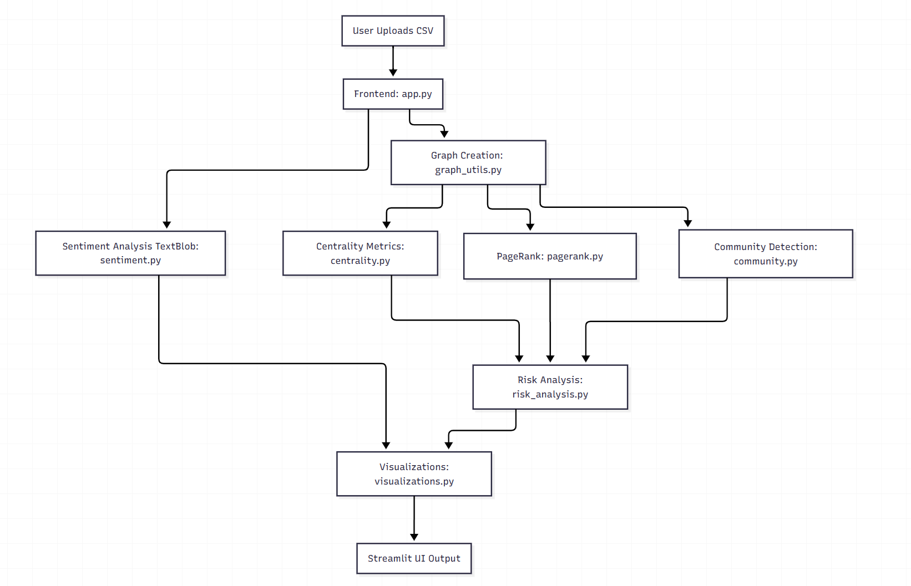

# 📞 Hoax Call Detection in Social Network Graphs

A powerful Streamlit-based dashboard to analyze suspicious calling patterns using graph theory, community detection, and centrality-based risk scoring.
<br><br>

## 🔍 Project Overview

This project analyzes a dataset of hoax calls and visualizes the calling network as a graph. Using **NetworkX**, **Louvain community detection**, and **centrality metrics**, the system identifies:

- 📊 Influential nodes  
- 🧠 Communities within the call network  
- 🚨 High-risk callers (based on composite centrality)  
- 🌐 Heatmaps & visualizations of call behavior
<br><br>

## 📬 Dataset Format (`hoax_call_data.csv`)

| Caller_ID | Receiver_ID | Timestamp              | Duration | Location        | Call_Type | Call_Text                         |
|-----------|-------------|------------------------|----------|------------------|-----------|------------------------------------|
| 1157      | 2049        | 2025-04-06 23:18:11.93 | 521      | Chicago          | Outgoing  | "This is a serious threat."        |
| 1200      | 8619        | 2025-04-12 18:12:11.93 | 280      | Houston          | Incoming  | "Please stay calm and alert."      |
| 1914      | 3517        | 2025-03-27 23:56:11.93 | 469      | Houston          | Outgoing  | "Thank you for your cooperation."  |


## 🗂️ Project Structure
```text
hoax_call_detection/
│
├── frontend/
│   └── app.py                 # Streamlit interface for visualization and interaction
│
├── backend/
│   ├── graph_utils.py         # Graph creation and adjacency matrix
│   ├── centrality.py          # Centrality metrics
│   ├── pagerank.py            # PageRank computation
│   ├── community.py           # Louvain community detection
│   ├── risk_analysis.py       # Risk scoring based on graph metrics
│   ├── sentiment.py           # Sentiment analysis using TextBlob
│   └── visualizations.py      # Graphs, bar charts, heatmaps
│
├── data/
│   └── hoax_call_data.csv     # Dataset with call logs + sentiments
│
├── requirements.txt

```

## 🛠️  Workflow Diagram


## 🚀 Getting Started

### 1. Clone the repository

```bash
git clone https://github.com/yourusername/hoax_call_detection.git
cd hoax_call_detection
```
### 2. Clone the repository
```bash
pip install -r requirements.txt
```
### 3. Run the Streamlit app
```bash
streamlit run frontend/app.py
```
<br>

## 📈Key Features

- **Graph Building**: Converts call logs into a directed communication network using NetworkX.
- **Community Detection**: Applies Louvain algorithm to identify densely connected clusters by location or time.
- **Centrality & PageRank**: Offers options to compute In-degree, Out-degree, Betweenness, Closeness, and Eigenvector centralities, as well as PageRank.
- **Risk Scoring**: Aggregates multiple centrality metrics into a unified risk score to flag high-risk nodes.
- **Sentiment Analysis**: Analyzes emotional tone of call text using TextBlob and visualizes distribution of sentiments.
- **Interactive Visualizations**: Includes dynamic heatmaps, top high-risk nodes, selected community graphs, and sentiment charts using Matplotlib.

<br>

## 📌 Dependencies
- Streamlit  
- Pandas  
- NetworkX  
- Matplotlib  
- Scikit-learn  
- Python-Louvain
- TextBlob
- Plotly
